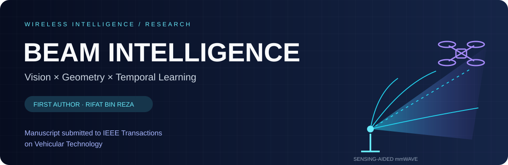
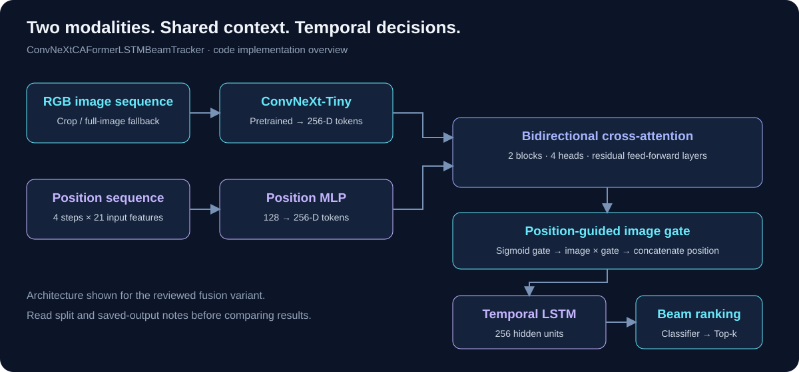
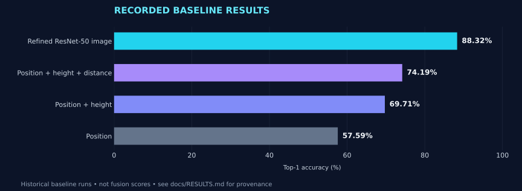

<p align="center"></p>

<div align="center">

# Sensing-Aided Beam Prediction
### See the scene. Understand the geometry. Rank the beams.

**First author: [Rifat Bin Reza](https://github.com/rifat-binreza)**  
Related manuscript submitted to **IEEE Transactions on Vehicular Technology**.


[**Explore the method**](#the-research) · [**View results**](#recorded-baseline-results) · [**Get started**](docs/GETTING_STARTED.md) · [**Figure gallery**](FIGURE_GALLERY.md)

</div>

---

## The research

Selecting a useful directional beam is central to mmWave drone communication. This project investigates how **camera observations, position and geometric context** can inform beam prediction, alongside **cross-modal attention and temporal learning** for image–position sequences.

<table>
<tr>
<td width="33%" valign="top"><h3>01 · Visual context</h3><p>Image-based ResNet-50 experiments and a pretrained ConvNeXt-Tiny encoder in the fusion workflow.</p></td>
<td width="33%" valign="top"><h3>02 · Geometric context</h3><p>Position-only, position + height, and position + height + distance baselines isolate the value of additional sensor inputs.</p></td>
<td width="33%" valign="top"><h3>03 · Temporal fusion</h3><p>Bidirectional cross-attention, a position-guided image gate and an LSTM combine image and position sequences.</p></td>
</tr>
</table>

### Fusion architecture in the code



The diagram follows `ConvNeXtCAFormerLSTMBeamTracker` in the [ConvNeXt fusion notebook](caformer_convnext_tiny_finetuned_random_split_final%20%281%29.ipynb): 256-dimensional embeddings, two four-head cross-attention blocks, a sigmoid image gate, and a 256-unit LSTM followed by a beam classifier. It describes the implementation; it is not a verified figure from the submitted manuscript.

## Choose your entry point

| Your goal | Start here | What you will find |
| :--- | :--- | :--- |
| Understand the recorded baseline comparisons | [Main experiment notebook](beam_predict_final_paper.ipynb) | ResNet-50 and position-family training, evaluation and plots |
| Explore multimodal temporal learning | [ConvNeXt fusion notebook](caformer_convnext_tiny_finetuned_random_split_final%20%281%29.ipynb) | Image/position alignment, crop preprocessing, cross-attention and LSTM |
| Navigate other model variants | [Experiment guide](docs/EXPERIMENTS.md) | CAFormer, image, traditional and position experiment inventory |
| Prepare data and environment | [Getting started](docs/GETTING_STARTED.md) | External inputs, paths, dependencies and execution order |
| Check what the numbers mean | [Results and reproducibility](docs/RESULTS.md) | Provenance, split differences and reporting boundaries |

## Recorded baseline results

**Saved research outputs, not a newly reproduced benchmark.** The following values come from the baseline experiment family and existing comparison report. They are **not CAFormer fusion scores** or a verified table from the submitted manuscript.

| Baseline modality | Top-1 ↑ | Top-2 ↑ | Top-3 ↑ | Top-5 ↑ |
| :--- | ---: | ---: | ---: | ---: |
| Position | 57.59% | 82.00% | 91.92% | 97.81% |
| Position + height | 69.71% | 89.03% | 95.17% | 99.03% |
| Position + height + distance | 74.19% | 89.99% | 96.05% | 98.95% |
| Refined ResNet-50 image model | **88.32%** | **97.81%** | **99.56%** | **99.82%** |



Adding height and distance raises recorded position-family Top-1 accuracy by **16.59 percentage points**, computed from unrounded values. The refined image result is recorded in the existing comparison report and plotting script; the notebook also preserves the earlier **87.62%** image-model output. See [exact provenance and limitations](docs/RESULTS.md).

<details>
<summary><b>How to interpret Top-k and the experiment splits</b></summary>

Top-k accuracy counts a sample as correct when its ground-truth beam appears among the model's k highest-ranked classes. This measures candidate ranking; it does not directly measure achieved throughput, latency or beam-training savings.

The baseline comparison and fusion notebooks use different label spaces and split protocols. The current ConvNeXt notebook selects `random_stratified`, while its saved split output says `sequence`; no completed final fusion metrics are saved in that notebook. Random splits of overlapping sequences can leak temporal context. Results from different settings must remain separate.

</details>

## Get started

**Review the [LICENSE](LICENSE) first.** This repository retains its existing proprietary license; public visibility does not make the code open source. The commands below are for authorized use.

```bash
git clone https://github.com/rifat-binreza/beam-prediction.git
cd beam-prediction
python -m venv .venv
# Activate the environment using your operating system's command.
python -m pip install -r requirements/base.txt
jupyter lab
```

For fusion experiments, additionally install `requirements/fusion.txt`. The notebook workflows require external **DeepSense 6G Scenario 23** data, split CSVs and, for fusion, prepared position sequences. These are not bundled. Follow the [setup guide](docs/GETTING_STARTED.md) before executing cells.

### Browse the figures without training

The [figure gallery](FIGURE_GALLERY.md) includes committed summary plots and ten diagnostics exported from saved notebook outputs. Authorized users can regenerate them:

```bash
python generate_ieee_comparison_figure.py
python export_notebook_figures.py
python results/prepare_web_gallery.py
```

These commands render recorded values and saved images; they do not train or evaluate models.

## Authorship, manuscript and provenance

**Rifat Bin Reza is the first author of the related submitted manuscript** and maintains this research presentation. The manuscript is **submitted to IEEE Transactions on Vehicular Technology**; acceptance or publication is not claimed.

The exact submitted title, complete author list and public manuscript link are not yet recorded here. See [research attribution](docs/AUTHORSHIP.md) for citation guidance. `main.tex` is an existing comparison draft with placeholder author fields, not a verified copy of the submission.

This repository is a research fork of [shovo896/beam-prediction](https://github.com/shovo896/beam-prediction). Original code, collaborator attribution, commit history and license are preserved. Paper authorship and Git commit authorship describe different contributions.

## Data and reference credit

Data: [DeepSense 6G, Scenario 23](https://www.deepsense6g.net/scenarios/Scenarios%2020-29/scenario-23), a drone-to-infrastructure sensing and communication scenario. Obtain the data from its provider and follow its access and citation terms.

Reference study: G. Charan et al., *Towards Real-World 6G Drone Communication: Position and Camera Aided Beam Prediction*, IEEE GLOBECOM 2022, [DOI: 10.1109/GLOBECOM48099.2022.10000718](https://doi.org/10.1109/GLOBECOM48099.2022.10000718). The existing [comparison report](IEEE_FINDINGS_COMPARISON.md) documents protocol differences; cross-study numbers are not a controlled superiority test.

---

<div align="center">

**Research at the intersection of wireless communications, vision and multimodal learning.**  
[Rifat's GitHub](https://github.com/rifat-binreza) · [Google Scholar](https://scholar.google.com/citations?user=U7HsBd4AAAAJ&hl=en) · [Contribution guide](CONTRIBUTING.md)

</div>
